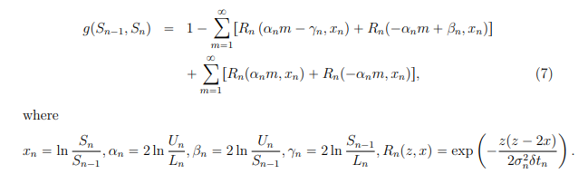

# Iteration 4:

Changes:
  - Results are now are logged to output.csv instead of the terminal
  - Used the exact brownian bridge formula for double barriers given on page 6, chapter 2.1, equation 7 for continiously monitored barriers:
    - 
  - The output of these continuous implementations matches the price, standard error and survival rate given by the paper in Chapter 6, page 26, Table 1, however it appears that the relative efficiency of the SMC is lower on my implementation but nonetheless shows SMC's better performance as the number of samplez and steps increased..

 
